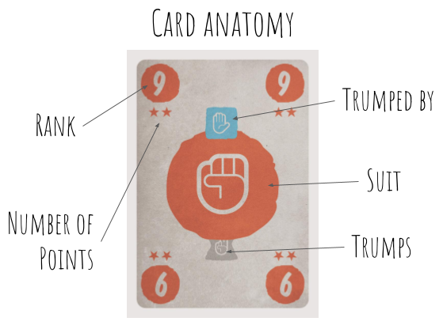

# TrickPaperScissors

*Trick taking game with changing trump suits determined by lead suit. Must follow if possible, score points by winning tricks and change the value of those points by trumping.*

### Instructions

Download the trick-paper-scissors.pcio file and import it into https://playingcards.io to create a new room.

### Setup

- Set the value of each suit to 1, and all the current points of each player to 0 (should be the default for a fresh room)

- 4p: Shuffle and deal out 9 cards to each player, discarding three face down (*Variant - discard face up to give more information*)

### Rules

- The game consists of a series of tricks, where each player plays one card from their hand to the table. Play continues for 9 tricks, until all cards have been played.

- Each trick, the lead suit establishes the trump suit according to **Rock** / **Paper** / **Scissors** rules i.e. **rock** trumps **scissors**, which in turn trumps **paper**, which trumps **rock**. e.g. If **Scissors** leads this hand, **rock** will be trump.

- Players follow clockwise around the table, and *must follow* if possible.

- When each player has played a card to the trick, the winner is the player that
  1. Played the highest *trump* suit card
  2. Or, if there was no *trump* card, played the highest *lead* suit card

- Winning a trick with a *lead* suit card:
  - Player takes the trick and scores a number of points from the stars on the *lowest* card of the *lead* suit in that trick.

- Winning a trick with a *trump* suit card:
  - Player may change the *value* of the points of the *trump* suit
  - Alter value by one step between -1 <-> 1 <-> 2
  - At the start of a game, every suit's value begins at 1

- In either case, the winner of a trick leads the next trick.

- When all tricks have been played, calculate each player's total score by multiplying the number of points in each suit by the value of points in that suit.

The player with the highest sum of the scores from all three suits wins the game.
